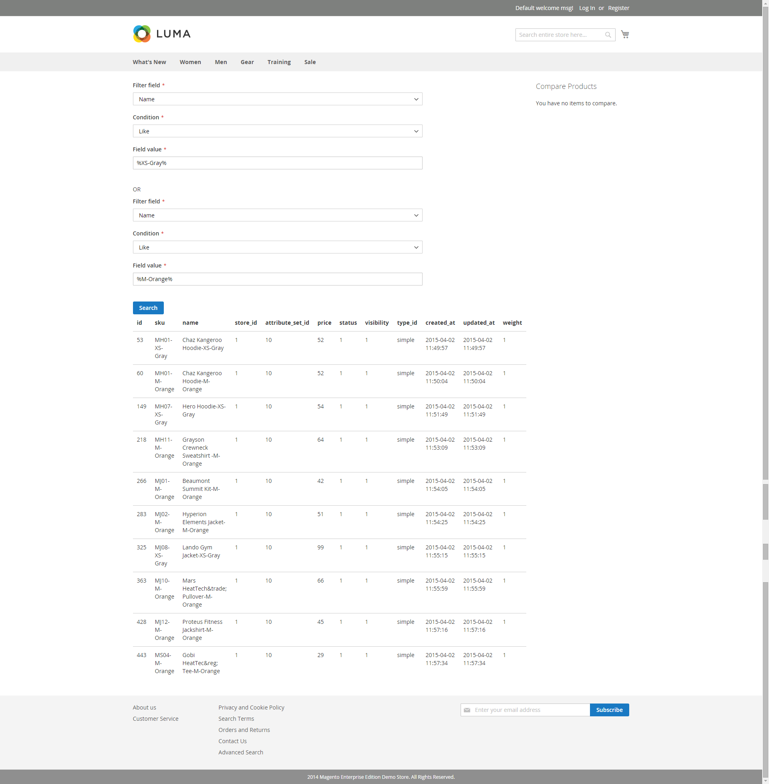

## Synopsis

This module contains a page which can be viewed at <m2root>/samplewebapiclient. This page features a demo of REST API being used to query products

## Motivation

This is one of a collection of examples to demonstrate the features of Magento 2.  The intent of this sample is to demonstrate how to use REST API.

## Technical feature

A simple page is displayed to collect data from a user and an ajax call is executed to get list of products. Products are filtered with help of SearchCriteria filters set by user.

## Installation

This module is intended to be installed using composer.  After including this component and enabling it, you can verify it is installed by going the backend at:

STORES -> Configuration -> ADVANCED/Advanced ->  Disable Modules Output

Once there check that the module name shows up in the list to confirm that it was installed correctly.

## Contributors

Magento Core team

## License

[Open Source License](LICENSE.txt)
